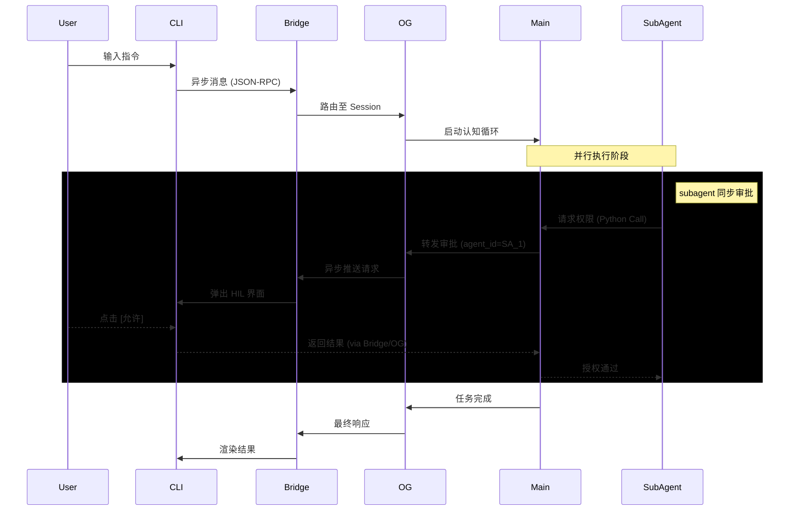

# MSC Architecture (TDD Redesign)

> "Security by isolation, efficiency by design."

## 核心架构原则

1. `分层沙箱`: Docker (可选外层) → Native FS Sandbox (原生隔离) → subagent 实例
2. `Agent Core 复用`: 所有 subagent 都是完整的 Agent Core Instance
3. `特殊 subagent`: TEA, Organizer 拥有独立的 Agent Core 定义
4. `Bridge 解耦`: 连接 Interface 与 Gateway 的轻量级消息总线

## 组件定义

### 1. Interface Layer (交互层)

- `CLI`: 基于 Typer + Rich 的终端界面
- `Web UI`: 未来扩展的 Web 界面 (通过 Bridge 接入)

### 2. Bridge Layer (桥接层)

- `前身`: Wire Protocol (kimi-cli 概念)
- `职责`: 轻量级 JSON 消息总线，解耦 Interface 与 Gateway
- `必要性`: 支持多前端共享同一后端逻辑
- `设计目标`: 极简实现，避免 kimi-cli Wire 的复杂度

### 3. Orchestration Gateway (OG) (编排网关)

- `OG Core`: 会话生命周期管理，协调各组件
- `Provider-Selector`: 根据任务复杂度、成本、安全需求路由到不同模型
- `Permission Manager`: 统一审批中心。支持 `agent_id` 路由，管理 `HIL` (Human-In-Loop) 状态。

### 4. Agent Core (认知核心)

- `Main Agent`: 主认知循环（感知-决策-执行）
- `Anamnesis`: 上下文管理器 (ContextManager)，管理 Hot/Cold 记忆分离
  - _注意_: 虽逻辑上类似受限 subagent，但不作为独立 Agent 实例运行
- `Skills`: MCP 工具 + `.agent/skills` 声明式技能注册表

### 5. Sandbox Layer (NFSandbox) (沙箱层)

- `Native Filesystem Sandbox`: 平台原生隔离机制
  - Linux: Landlock + seccomp
  - Windows: Windows Sandbox / Restricted Token
  - macOS: Seatbelt
- `Docker`: 可选的最外层容器，开发时可忽略

## 7. 认知上下文布局 (Context Layout)

为了对抗注意力稀释并优化推理效率，MSC 采用标准化的 System Prompt 布局。详细的布局规范、记忆分层逻辑及 `Lite RAG` 机制请参阅 [`.roo/rules/anamnesis-and-context-manager.md`](anamnesis-and-context-manager.md)。

## 数据流与审批协议

### 1. 审批流 (Approval Flow)

MSC 采用“异步消息，同步阻塞”的混合审批模型：

- `Main Agent & TEA`: 强制 `HIL` (Human-In-Loop)。审批请求通过 Bridge 异步发送至 Interface，但 Agent 认知循环在收到响应前保持阻塞。
- `subagents`: 默认同步审批。审批请求在 Python 进程内通过函数调用传递，仅阻塞当前 subagent 实例，不影响 Main Agent 或其他并行 subagents。
- `路由元数据`: 所有审批请求必须携带 `agent_id`。Interface 根据此 ID 渲染对应的上下文，确保用户知晓审批来源。
- `拒绝策略`: 拒绝审批仅取消当前请求。已运行的 subagents 及其权限不受影响，维持系统运行的连续性。

### 2. 交互序列图

## 沙箱层级详解

- `L1 (Native)`: 平台原生机制限制文件系统访问
- `L2 (Docker)`: 可选的额外隔离层，开发时可跳过直接使用 L2
