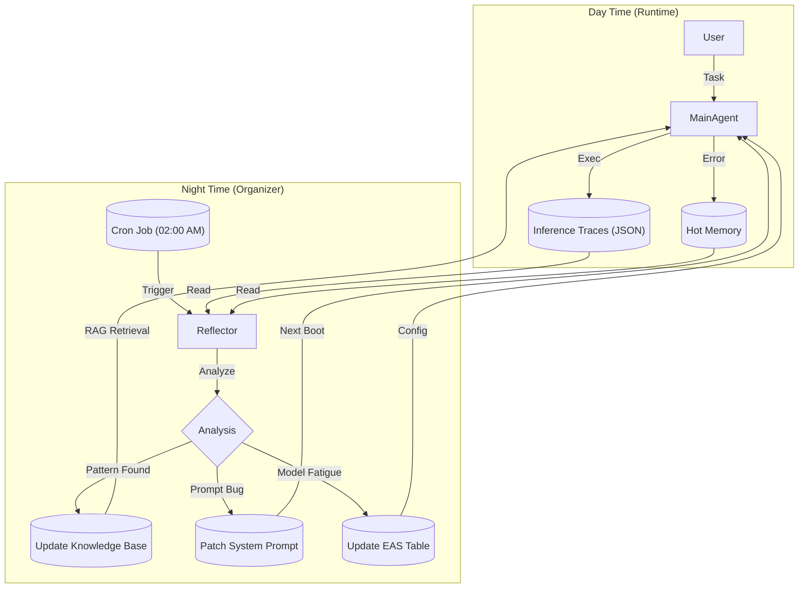

# Organizer: 异步元认知与自举优化引擎

> "We cannot solve our problems with the same thinking we used when we created them." — Albert Einstein
>
> "In the MSC, we don't just execute; we iterate on the executor."

## 不幸的现实：基于 Prompt Engineering 的元认知模拟

必须明确：**Organizer 并不是真正的优化器**，它无法在神经元层面执行梯度下降。在当前的工程实现中，它是一个通过 **Prompt Engineering** 尽可能模拟反向传播逻辑的“伪自举”组件。

如果说 **Main Agent** 是在执行前向传播（Forward Pass），根据现有的 Prompt 和 Context 生成代码；那么 **Organizer** 就是在尝试执行一种**语义维度的反向传播**。它不参与实时的任务执行，而是作为一个**异步的、批处理的元认知进程**，致力于优化系统的“语义权重”——即 System Prompts、Knowledge Base 和 Tool Definitions。

### Reality Check

- **Fiction**: 一个在数字虚空中冥想的高维意识，审视着所有子人格的记忆，剔除杂质，升华智慧。
- **Target**：基于 `NSU` 和 `ARS2-Neo` 的永续学习系统`Tiny-ONN`，稀疏梯度精确命中低效的待矫正参数，参数沿损失函数的测地线滑行。
- **Now**: 一个 **Python Cron Job**。每天凌晨 02:00 运行，遍历 `logs/` 目录下的 JSON 文件，调用 LLM 进行总结，并提交 Git Commit。

## 2架构定义

Organizer 的工作流是一个闭环的 OODA Loop (Observe-Orient-Decide-Act)，但作用于元层面。

### 输入源 (Observe)

Organizer 并不直接观察环境，而是观察“观察者的记录”：

1. **Inference Traces**: 详细的 JSON 执行日志，包含摘要过的 User Prompt, Tool Call, Output, Error。
2. **Git Diff**: 代码库的变更历史。
3. **Cost Reports**: Token 消耗与 API 费用统计。

### Orient & Decide

#### Failure Clustering

它将过去 24 小时内的失败任务（Exit Code != 0 或被用户回滚的任务）进行聚类。

- *现象*: 3 个不同的任务都因为 `pandas` 版本不兼容挂了。
- *洞察*: "环境中预装的 pandas 版本与常用代码片段不匹配。"

#### Knowledge Distillation -> 联动 Anamnesis

它是 **Anamnesis** 架构中 "Cold Knowledge" 的主要生产者。

- 它将零散的 `[ANAMNESIS_BLOCK]`（热记忆）提取出来，去重、泛化，生成结构化的 Markdown 知识卡片。
- *产出*: `knowledge_base/python/pandas_compatibility.md`

#### EAS Calibration

它根据模型在长上下文任务中的表现（如是否出现幻觉、遗忘指令），动态调整 `eas_table.json`。

- *调整*: "Gemini-3 在超过 128k token 后开始胡言乱语，将其 EAS 阈值下调至 100k。"

### Act

Organizer 是系统中唯二拥有 **Git Write** 权限的实体（另一个是人类）。

1. **Patching Prompts**: 如果发现某个指令经常被误解，它会创建一个 Pull Request 来修改 `prompts/system.md`。
2. **Updating Knowledge**: 提交新的知识卡片到 `knowledge_base/`。
3. **Archiving Logs**: 将处理过的原始 JSON 日志压缩归档，保持工作区整洁。

## The Night Shift

## 行为准则与安全限制

### 严禁直接干预

Organizer **绝对禁止**直接修改业务代码（User Code）。它只能修改：

- 文档 (`docs/`)
- 知识库 (`knowledge_base/`)
- 代理配置 (`config/`)
- 提示词模板 (`prompts/`)

### 悲观主义验证

在提交 Prompt 修改建议前，Organizer 必须在沙箱中运行一组 **Regression Tests**（回归测试），确保新的 Prompt 不会破坏现有的能力（Catastrophic Forgetting）。

## 总结

Organizer 是 MSC 系统的**进化模拟器**。它终究不是优化器，无法改变模型的底层概率分布。但通过“事后诸葛亮”式的日志分析与 Prompt 迭代，它能将每一次昂贵的错误转化为廉价的文本规则，在语义层面实现系统的**熵减**。
